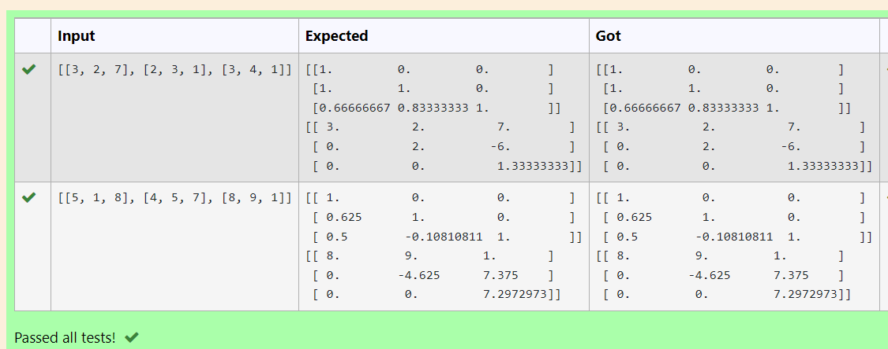
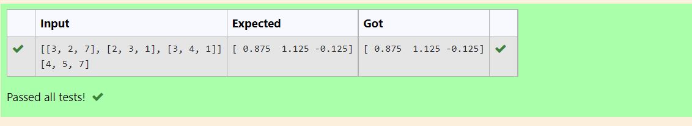

# LU Decomposition without zero on the diagonal

## AIM:
To write a program to find the LU Decomposition of a matrix.

## Equipments Required:
1. Hardware – PCs
2. Anaconda – Python 3.7 Installation / Moodle-Code Runner

## Algorithm
1. import numpy library using import statement.
2. From scipy package import lu().
3. Get input from user and pass it as an array.
4. Get P, L U martix using lu().
5. print L and U matrix.
## Program:
```
/*
Program to find the LU Decomposition of a matrix.
Developed by: Ezhil Mathi R
RegisterNumber: 21500766 

# To print L and U matrix
import numpy as np
from scipy.linalg import lu
A = np.array(eval(input()))
P,L,U=lu(A)
print(L)
print(U)

```
# To print X matrix (solution to the equations)
import numpy as np
import scipy
from scipy.linalg import lu_factor,lu_solve
A=np.array([[3,2,7],[2,3,1],[3,4,1]])
b=np.array([4,5,7])
lu, piv=lu_factor(A)
x=lu_solve((lu,piv),b)
print(x)

*/
```

## Output:
```




## Result:
Thus the program to find the LU Decomposition of a matrix is written and verified using python programming.

